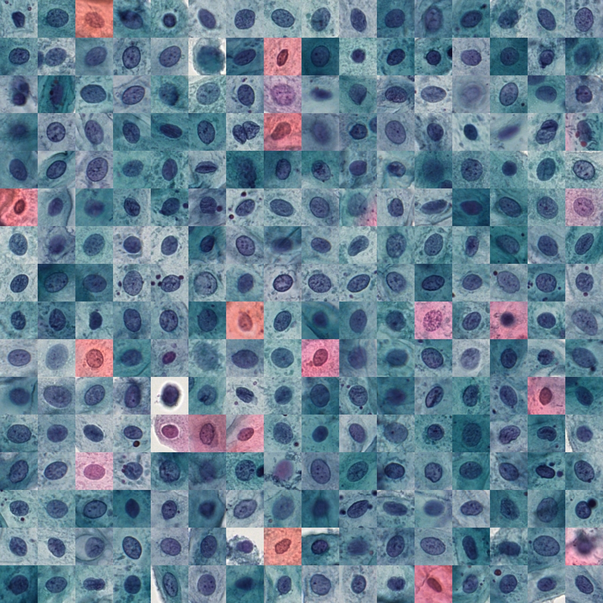

[](./LICENSE.MD) [](https://www.python.org/download/releases/3.6.0/) [](https://996.icu) 

# Oral Cell Screening Project

Code of paper [A Deep Learning based Pipeline for Efficient Oral Cancer Screening on Whole Slide Images](http://arxiv.org/abs/1910.10549)

------

## Usage instruction

Each sub-directory contains a separate README instruction. File paths in the code might need to be changed before running.

- [`OralCellDataPreparation/`](./OralCellDataPreparation/) – Nucleus Detection (ND) and Focus Selection (FS) modules trained on our data. This will prepare all nucleus patches for classification. It can be tuned to better performance on a new dataset by the code in two directories below:
  - [`NucleusDetection/`](./NucleusDetection/) – to customise the ND module. 
  - [`FocusSelection/`](./FocusSelection/) – to customise the FS module. 
- [`Classification/`](./Classification/) – Classification module.

## Example results

<div align="center">
     
    <br>
    <div style="color:orange; border-bottom: 1px solid #d9d9d9;
    display: inline-block;
    color: #999;
    padding: 2px;">Left: pineline on pap-smear data; Right: pineline on liquid-based data</div>
</div>

## Dependencies

[`oralscreen_env.yml`](./oralscreen_env.yml) includes the **full** list of packages used to run the experiments. Some packages might be unnecessary.

## Citation

Please cite our paper if you find the code useful for your research.

- J. Lu *et al.*, “A Deep Learning based Pipeline for Efficient Oral Cancer Screening on Whole Slide Images,” *International Conference on  Image Analysis and Recognition*, 2020.

```
@inproceedings{OralScreen,
            author = {Lu, Jiahao and Sladoje, Nataša and Stark, Christina Runow and Ramqvist, Eva Darai and Hirsch, Jan-Michaél and Lindblad, Joakim},
            booktitle = {International Conference on  Image Analysis and Recognition},
            title = {A Deep Learning based Pipeline for Efficient Oral Cancer Screening on Whole Slide Images},
            year = {2020}}
```

## Acknowledgement

This work is supported by: Swedish Research Council proj. 2015-05878 and 2017-04385, VINNOVA grant 2017-02447, and FTV Stockholms Län AB.